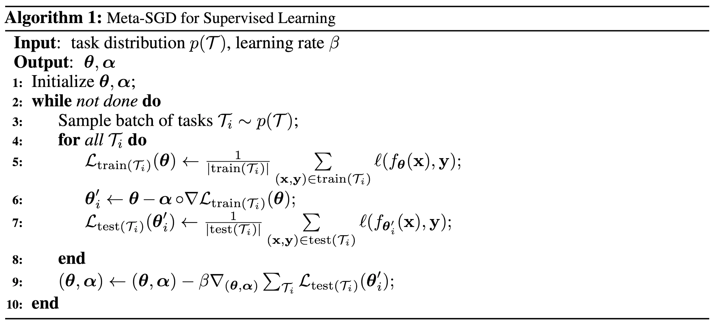
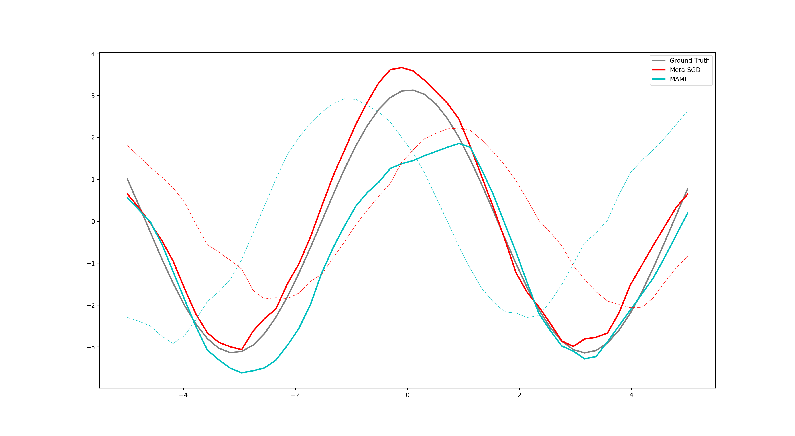

# Meta-SGD: Pytorch Implementation
A Pytorch Implementation of the __"Meta-SGD"__. 

In this repo, I experimented on K-shot sinusoid regression of Meta-SGD and compared its performacne with MAML.
## Pseudocode

## Results
|                | Meta-SGD | MAML   |
| -------        | -------- | ------ |
| Loss (10-shot) | 0.3145   | 0.6702 |

## Reference
[Meta-SGD: Learning to Learn Quickly for Few-Shot Learning](https://arxiv.org/abs/1707.09835)

